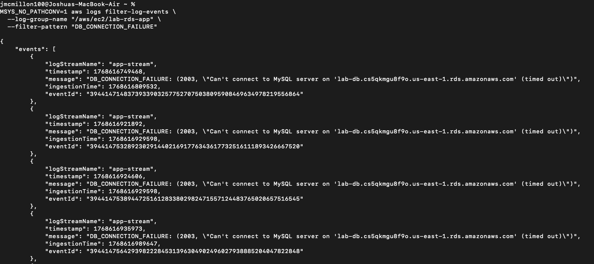

### 🚨 Incident Response Operations

Incident Title: Production Database Connectivity Timeout

Scenario: Application reported connection failures

Evidence of Injection (Broken State):

(Database connection was interrupted.)


1.1 Confirming Email Alert

After receiving the SNS notification email, I verified the alarm state via the CLI to confirm the cloudwatch system was indeed in alarm.

**Evidence:** Email alarm notification.

> 

- **Command:**
    
    Bash
    
    ```
    aws cloudwatch describe-alarms \
      --alarm-names lab-db-connection-failure \
      --query "MetricAlarms[].StateValue"
    ```
    
- **Result:** `ALARM`
    

**Evidence:** CLI output confirming alarm state.

> 

#### **RUNBOOK SECTION 2 — Observe**

2.1 Check Application Logs

I used the CLI to querie the centralized CloudWatch logs to identify the specific error signature (DB_CONNECTION_FAILURE) associated with the alarm.

- **Command:**
    
    Bash
    
    ```
    aws logs filter-log-events \
      --log-group-name /aws/ec2/lab-rds-app \
      --filter-pattern "DB_CONNECTION_FAILURE"
    ```
    
- **Result:** The logs returned `(2003, "Can't connect to MySQL server on ... (connection refused)")`.
    

Evidence: CLI output showing active error stream.

CLI Output of CloudWatch logs for log group /aws/ec2/lab-rds-app, using  `DB_CONNECTION_FAILURE` filter:

> 

**2.2 Identify Failure Type**

- **Classification:** **Network / Database Connection Failure**
    
- **Justification:** The log message explicitly states `connection refused` (Error 2003).
    
    - If it were a **Credential** issue, the error would be `Access denied` (1045) because the DB would receive the request and reject it.
        
    - A **Refused Connection** indicates the request was sent but there was no ability to connect evern with proper security groups. In the majority of cases, this is due to a databases not being configured/ set up correctly.

#### **RUNBOOK SECTION 3 — Validate Configuration Sources**

3.1 Retrieve Parameter Store Values

I also verified that the application is attempting to connect to the correct RDS endpoint and port.

- **Command:**
    
    ```bash
    aws ssm get-parameters \
      --names /lab/db/endpoint /lab/db/port /lab/db/name \
      --with-decryption
    ```
    
- **Result:** The correct Endpoint and Port (3306) were returned, ruling out a configuration drift.
    

**Evidence:** SSM Output retrieved from Application EC2.

> 

3.2 Retrieve Secrets Manager Values

I verified the credentials available to the application to ensure they hadn't been corrupted or deleted.

- **Command:**
    
    Bash
    
    ```
    aws secretsmanager get-secret-value --secret-id lab/rds/mysql
    ```
    
- **Result:** Valid JSON payload returned.
    

**Evidence:** Secrets Manager Output retrieved from Application EC2.

> 

#### **RUNBOOK SECTION 4 — Containment**

**4.1 Prevent Further Damage**

- **Statement:** System state preserved for recovery. No EC2 restart, credential rotation, or infrastructure redeployment was initiated.
    

#### **RUNBOOK SECTION 5 — Recovery**

5.1 Execution (Remediation)

Having identified the root cause as a disconnect, I checked the connection of MYSQL Database. I discovered the database had temporarily been stopped whcih was the cause of the disruption. I manually restated the database to allow acces to the databse again.

5.2 Verification

I verified application connectivity using the public endpoint.

- **Command:** `curl http://<EC2_PUBLIC_IP>/list`
    
- **Result:** The application returned the expected JSON list, indicating the connection to the database was restored.
    
#### **RUNBOOK SECTION 6 — Post-Incident Validation**

6.1 Confirm Alarm Clears

I monitored the alarm state to ensure it automatically resolved once the errors stopped.

- **Command:**
    
    Bash
    
    ```
    aws cloudwatch describe-alarms \
      --alarm-name lab-db-connection-failure \
      --query "MetricAlarms[].StateValue"
    ```
    
- **Result:** `OK`
    

**Evidence:** CLI command showing Alarm state OK.

> 

**6.2 Confirm Logs Normalize**

- **Command:** `aws logs filter-log-events ...`
    
- **Result:** No new error logs generated after the fix timestamp.
    
### **Success**