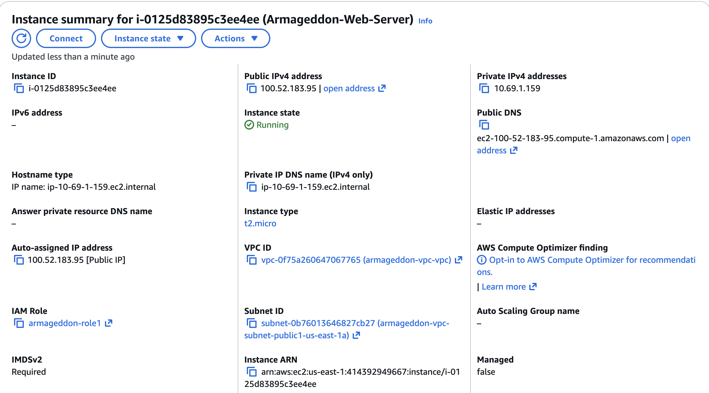
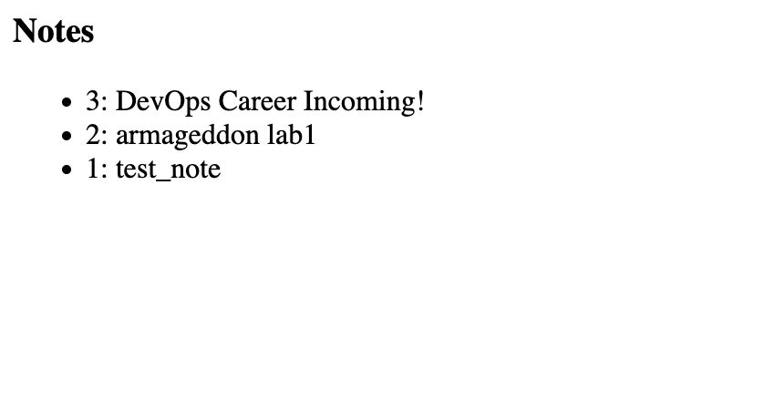

## 📸 Lab 1 Screenshots

### a. 🛡️ RDS Security Group Inbound Rule
**Source:** `ec2-lab-sg` | **Port:** `3306`

This inbound rule restricts traffic strictly to the security group `ec2-lab-sg` on port **3306**. This ensures only our specific EC2 instances can communicate with the database.

### b. 🪪 EC2 IAM Role Attached

### c. ✅ App Verification (`/list` output)
*Success! The application is connected and retrieving data.*

## 📝 Short Answers

### a. Why is DB inbound source restricted to the EC2 security group?
* **The DB inbound source is restricted to the EC2 security group because it enhances security by ensuring that only EC2 instances within that specificsecurity group can access the database. This is what is know as "least privlage" and minimizes exposure to potential threats from other sources and helps protect sensitive data stored in the database.**

### b. What port does MySQL use?
* **MySQL uses port 3306 for database connections.**

### c. Why is Secrets Manager better than storing creds in code/user-data?
* **Secrets Manager is better than storing credentials in code or user-data because it provides a secure and centralized way to manage sensitive information. Because of  features like: automatic rotation of credentials, encryption at rest and in transit, and fine-grained access control through IAM policies. This reduces the risk of credential exposure and simplifies the management of secrets compared to hardcoding them in application code or user-data scripts.**
